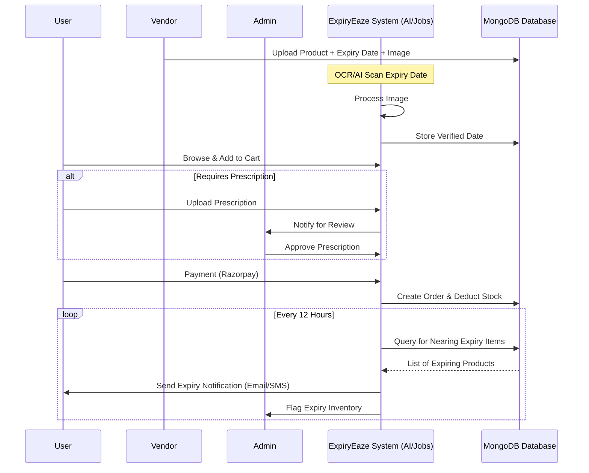

# ExpiryEaze

  
  
  

ExpiryEaze is a sophisticated React-based ecosystem designed to combat food and medical waste by bridging the gap between vendors with near-expiry products and budget-conscious consumers. The platform leverages AI-driven OCR technology to automate inventory management and ensure consumer safety through prescription verification.

## 🏗️ System Architecture

The following sequence diagram illustrates the end-to-end workflow of the ExpiryEaze ecosystem, from product onboarding to automated expiry notifications.

## 🚀 Key Features

### For Consumers
*   **Intuitive Discovery** Browse a wide range of groceries and medicines with real-time availability.
*   **Smart Filtering** Sort by location, category, and prescription requirements.
*   **Secure Transactions** Integrated Razorpay gateway for seamless and safe payments.
*   **Prescription Portal** Easy upload and verification system for restricted medications.

### For Vendors
*   **Automated Onboarding** AI-powered OCR to extract expiry dates from product images automatically.
*   **Analytics Dashboard** Real-time insights into revenue, stock levels, and expiry trends.
*   **Inventory Control** Effortless management of product listings and category assignments.
*   **Stock Optimization** Automated flagging of near-expiry items to minimize losses.

### Administrative Control
*   **Validation Engine** Review and approve prescriptions to maintain regulatory compliance.
*   **System Monitoring** Oversight of all transactions and inventory movements.
*   **Automated Notifications** Configurable alerts for both users and admins regarding product status.

## 🛠️ Technology Stack

  
  
  
  
  
  

## ⚙️ Getting Started

### Prerequisites
*   Node.js (v14.0.0 or higher)
*   npm (v6.0.0 or higher)

### Installation Steps
1.  Clone the repository and navigate to the project root.
2.  Install dependencies using `npm install`.
3.  Configure environment variables in the `.env` file.
4.  Execute `npm start` to launch the development server at `http://localhost:3000`.

## 📁 Project Organization

*   **src/components** Reusable UI elements like Header, Footer, and Product Cards.
*   **src/pages** Core application views including Dashboards and Checkout flows.
*   **src/assets** Static resources and design tokens.
*   **public** Entry point and global assets.

## 🛡️ Security & Compliance
*   **Data Integrity** Secure validation of all incoming product and prescription data.
*   **Payment Security** PCI-compliant transaction handling via Razorpay integration.
*   **Access Control** Distinct role-based dashboards for Users, Vendors, and Administrators.

## 📄 License
Distributed under the MIT License. See `LICENSE` for more information.

  <b>ExpiryEaze — Reducing Waste, Enhancing Access.</b>

